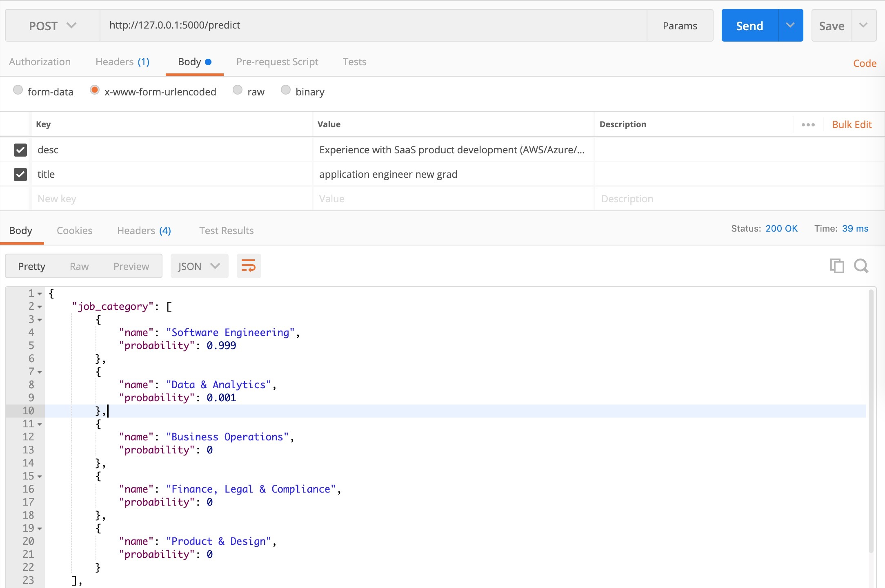

This project is used for the auto-classification of job categories, job types and experience levels for the spiders.

Currently, it only supports 5 most frequent job categories and 10 most frequence job types. (The rest need more data for the models to learn well.)

## Environment
Python 3.8.5


## Install Packages

```shell
pip install --user -r requirements.txt
```

```shell
python setup.py
```

## Run Server
```shell
python server.py
```

In development mode, we can sent POST request to the API `localhost:5000/predict` by setting two fields: job title `title` and job description `desc`.

The screenshot is made by Postman as an example.